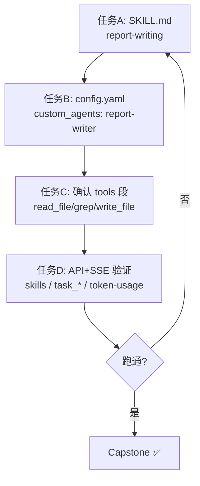

我读一下真实的 `tools.py` 与 `config.example.yaml`，确认工具注册机制和可用工具名，好把第七阶段落在真东西上。
核实完成，我把真实情况摆清楚，并给你一份**完全落在真实代码上**的第七阶段方案。

## 纠正说明（重要）

1. **ResourceMap 是我记错/编造的记忆**，已删除。仓库里：
   - 没有 `ResourceMapWorkspacePage.vue`，没有任何 `resource_map` 后端代码（全仓 0 个文件）。
   - `skills/` 目录只有 `storage/`、解析/校验等 `.py`，**没有 `public/`、`custom/` 子目录，更没有 `SKILL.md`**——印证了第四阶段"Skill 由用户/平台动态提供"的结论。

2. **好消息**：我之前随口写的 `read_file` / `write_file` / `bash` / `web_search` 这些工具名**其实是真实存在的**——只是它们不在 `builtins/` 目录里，而是作为 `config.yaml` 的 `tools:` 配置项，通过 `use:` 类路径动态加载（`config.example.yaml:371-495` 有完整定义）。所以"子 Agent + 工具白名单"这条主线**依然成立**，只是不能再挂"ResourceMap"这个不存在的底座。

---

# 第七阶段（修正版）：实战项目——「报告生成流水线」

## 一、目标（全部基于已验证的真实组件）

```
用户: "读取 /workspace/data/ 下的日志，分析异常并生成一份报告"
        │
        ▼
主 Agent
  ├─ 启用 Skill「report-writing」→ 注入"报告标准范式"知识（第四阶段·真实机制）
  └─ 派 sub-agent「report-writer」→ 专用子 Agent（第五阶段·真实机制）
        ├─ tools: [read_file, grep, write_file]   ← config.yaml 真实工具名
        ├─ disallowed_tools: [task]               ← 防递归（第五阶段坑6）
        └─ skills: [report-writing]               ← 白名单加载刚才的 Skill
        ▼
子 Agent 读文件 → 分析 → 用 write_file 落盘报告 → task_completed 回传
```

这条链路 100% 建立在你已读通的真实源码上：**Skill 系统（阶段4）、子 Agent 编排（阶段5）、AppConfig/工具注册（阶段6）**。

## 二、任务拆解

### 任务 A：建一个 Skill（第四阶段，真实可落）
- 目录：`deer-flow/skills/custom/report-writing/SKILL.md`（需新建 `skills/custom/` 目录）
- frontmatter：`name: report-writing`（hyphen-case）、`description: ...`、`allowed-tools: []`
- 正文：报告三段式范式（摘要 / 异常清单 / 处置建议）
- 启用：在 `extensions_config.json` 的 `skillStates` 置 `report-writing: {enabled: true}`（`skillStates` 控制启用态，后台线程 5s 刷新缓存）

### 任务 B：加自定义子 Agent（第五阶段，真实可落）
在**你的 `config.yaml`** 的 `subagents.custom_agents`（参照 `config.example.yaml:659-675` 的注释模板）加：
```yaml
subagents:
  custom_agents:
    report-writer:
      description: 读取工作区文件、分析异常并生成结构化报告。
      system_prompt: |
        你是一名报告撰写专家。先读文件，再按"摘要/异常/建议"输出。
      tools: [read_file, grep, write_file]
      disallowed_tools: [task]
      model: inherit
      max_turns: 30
      timeout_seconds: 600
```
映射点：`custom_agents` 解析顺序（registry.py）、`task` 被 `subagent_enabled=False` 自动拦截、`skills` 白名单交集。

### 任务 C：确认工具已启用（第六阶段，真实可落）
在 `config.yaml` 的 `tools:` 段确认 `read_file` / `grep` / `write_file` 已定义（参考 `config.example.yaml:468-484`）。`get_available_tools` 通过 `use: deerflow.sandbox.tools:read_file_tool` 反射加载（`tools.py:73`）。

### 任务 D：端到端验证（贯穿测试）
- `GET /api/skills` → 确认 `report-writing` 被扫描到且 `enabled=true`
- 发消息触发 `task(subagent_type="report-writer")`，DevTools 看 `task_started/running/completed`
- `GET /api/threads/{tid}/token-usage` → 看 `subagent:report-writer` 用量

## 三、计划图



## 四、风险点（真实代码层面）
- Skill 不启用 = 主 Agent 看不到（`enabled` 必须 true，第四阶段坑1）
- 子 Agent 误拿 `task` → `subagent_enabled=False` 自动拦截（第五阶段坑6）
- `name` 必须 hyphen-case，否则 `validation.py` 正则拒绝（第四阶段坑2）
- `read_file` 等需沙箱可用（LocalSandboxProvider 默认提供，host bash 才需额外开）

---

## 请你拍板

当前是 **ask 模式（只读）**，我不会改文件。请确认：

1. **方案范围**：选上面的「报告生成流水线」Capstone，还是更轻量（只做 任务A+任务D，验证 Skill 机制即可）？
2. 确认后，我会先把**每个文件的具体改动 diff 方案**列给你审（遵守你"改前先分析、改后验证"的规则），再请你切 **craft 模式** 落地。

需要我现在就把「任务 A/B/C 的精确改动内容」展开成可直接照抄的草案吗？